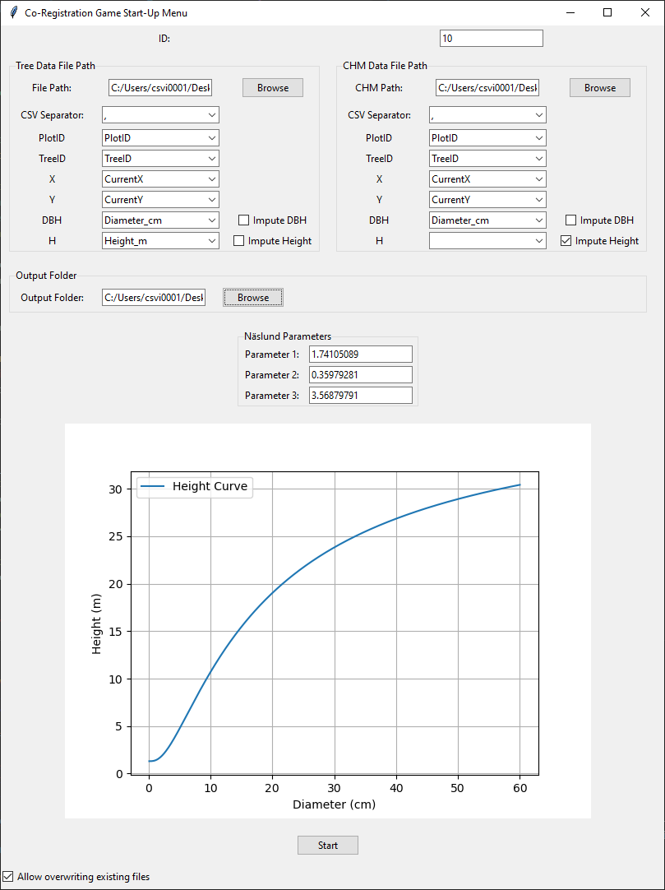
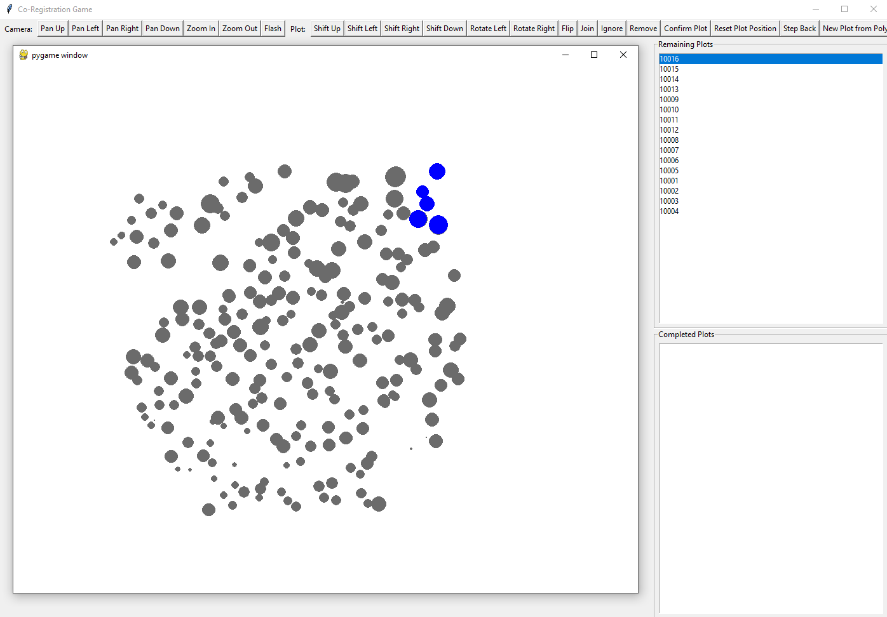
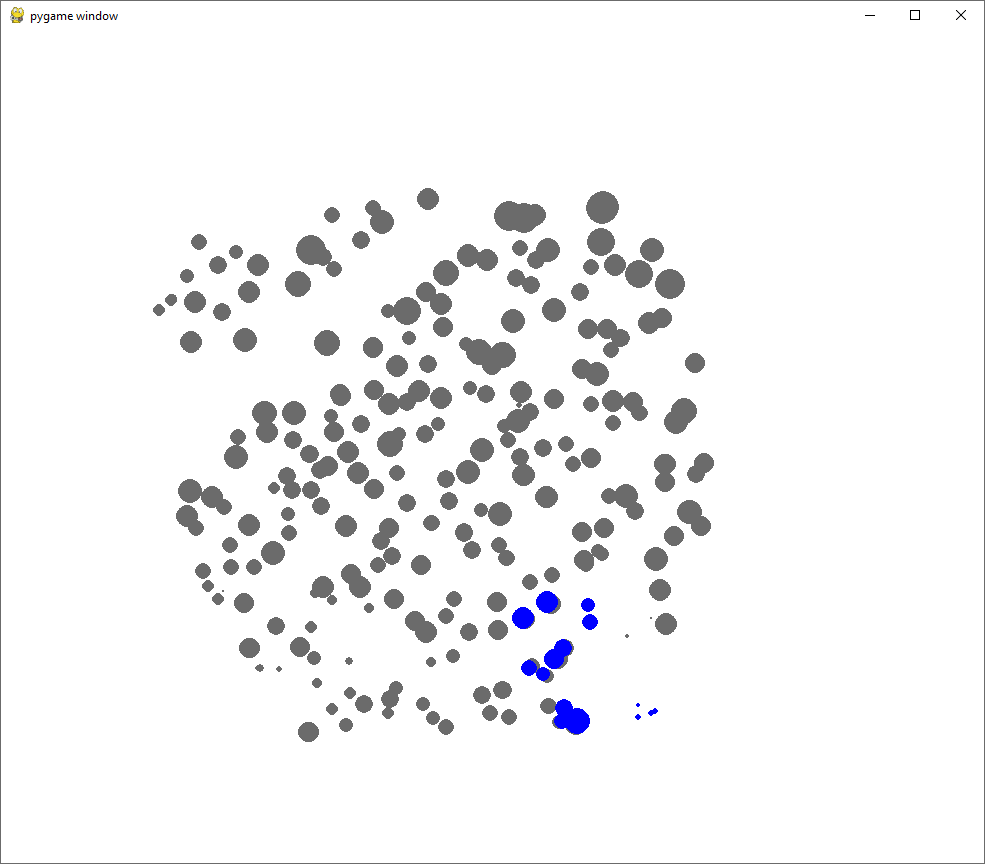
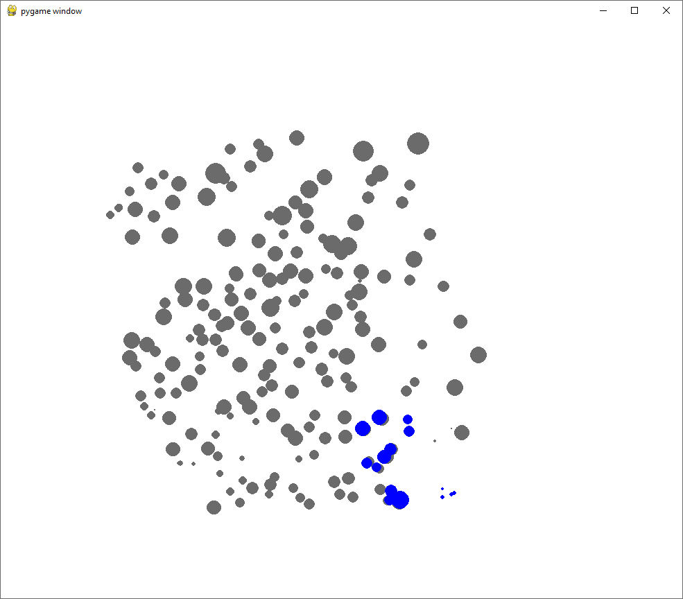
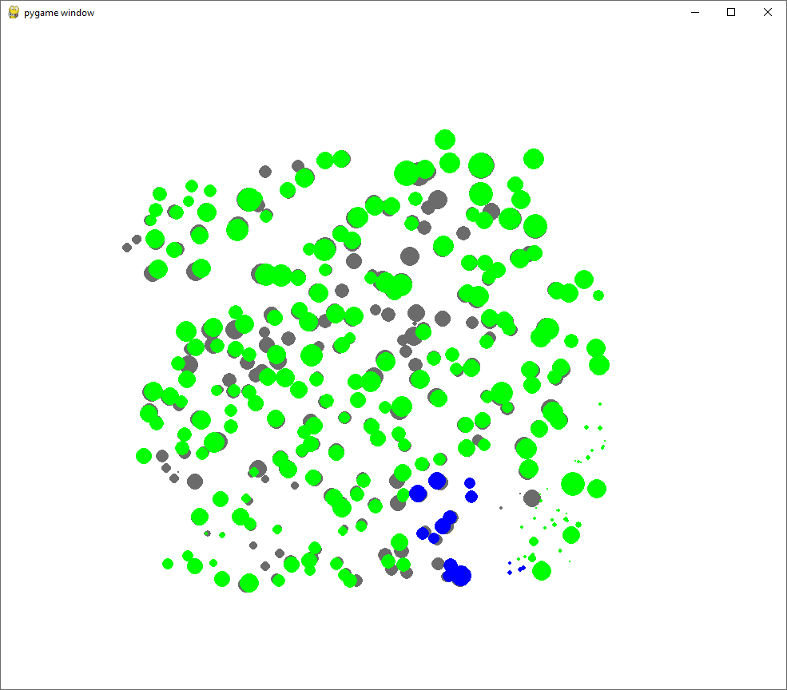
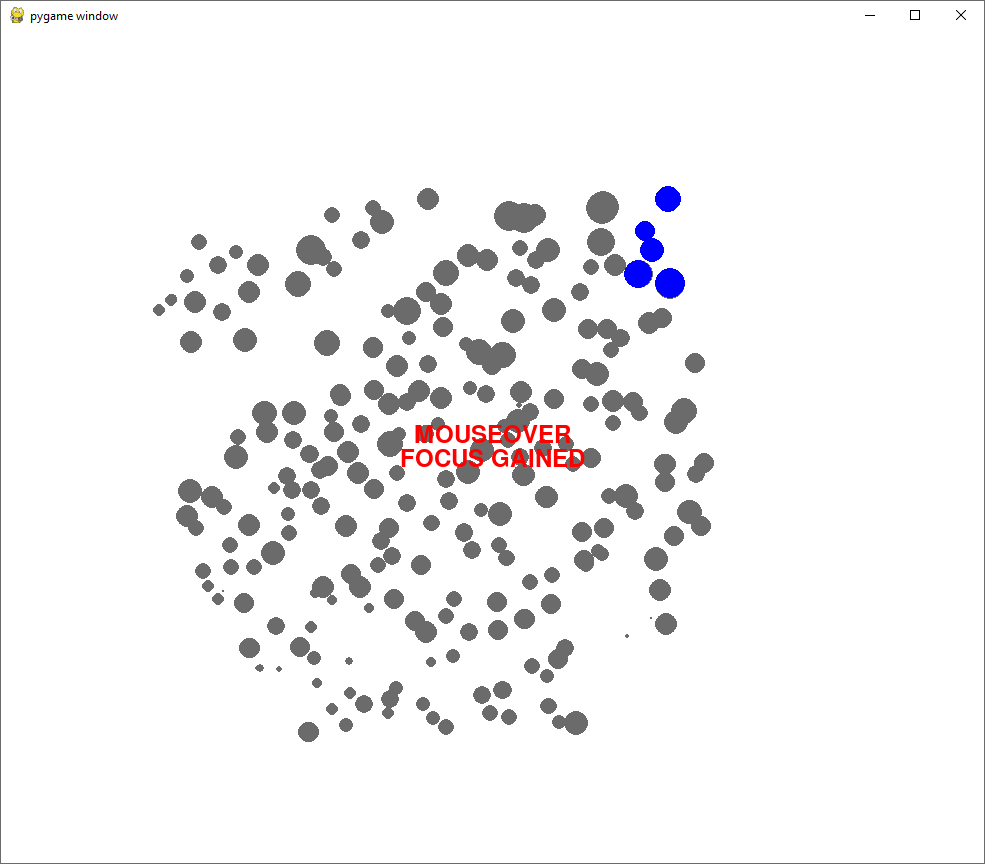
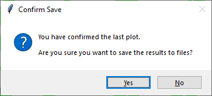
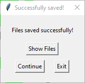
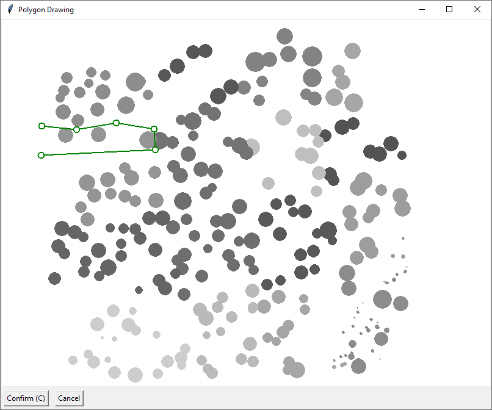

# Co-Registration Game

The **Co-Registration Game** is an interactive tool designed for forest resource management. It allows users to align (or “co-register”) tree plot data with canopy height model (CHM), or other saved data using an intuitive graphical interface. The application supports manual adjustments via a range of keyboard shortcuts and provides options for data imputation based on height-diameter relationships.

## Table of Contents

- [Overview](#overview)
- [Input Data Requirements](#input-data-requirements)
- [Installation](#installation)
- [Running the application](#running-the-application)
- [Usage](#usage)
- [UI Guide](#ui-guide)
- [Plot Breakout](#plot-breakout)
- [Keyboard Shortcuts](#keyboard-shortcuts)
- [Outputs](#outputs)
- [License and Credits](#license-and-credits)
- [Citations](#citations)

## Overview

The Co-Registration Game helps forest managers and researchers to:
- **Visualize** tree and CHM data in a unified viewport.
- **Adjust** tree plot positions interactively using rotation, translation, and flipping.
- **Optimize** the registration between field-measured tree data and remotely sensed CHM data.
- **Impute** missing tree parameters (e.g., height or diameter) using a Näslund (1936) height–diameter relationship (Startup parameters are applied during data load when one variable is missing).

The tool integrates a Tkinter-based startup menu for data selection and configuration with a Pygame-based interactive display for the co-registration process.

## Input Data Requirements

The program requires two CSV files:

1. **Tree Data File** (Field Data):  
We refer to this as Layer 1.

2. **CHM Data File** (Canopy Height Model):  
We refer to this as Layer 2.

**The program will attempt to find a transform for Layer 1 so that it matches Layer 2.**

**Note:**  
The startup menu allows you to map your CSV column names to the required fields. If your data file does not include a stand identifier column (or any other column), you can leave the mapping empty; in that case, all rows will be assumed to belong to the provided stand ID.

## Installation

### Using Conda

A sample `environment.yml` is provided to create a Python virtual environment with the required dependencies.

```yaml
name: CoRegGameEnv
channels:
  - conda-forge
  - defaults
dependencies:
  - python=3.9
  - numpy
  - pandas
  - scipy
  - matplotlib
  - pygame
  - pynput
  - tk
```

To create and activate the environment: 
```bash
conda env create -f environment.yml
conda activate CoRegGameEnv
```

### Using pip
Alternatively, install the dependencies via pip: 
```bash
pip install numpy pandas scipy matplotlib pygame pynput tk
```

## Running the application
Activate the correct Python virtual environment (e.g., CoRegGameEnv if you used the environment.yml file).

Navigate to the root directory of the project in your terminal.

Run the startup script:
```bash
python startup.py
```
This will launch the Startup Menu.

## Usage

The startup menu (built with Tkinter) will allow you to:

- Select the Tree Data File and CHM Data File.
- Specify CSV separators.
- Map your CSV column names to the required fields (StandID, PlotID, TreeID, X, Y, DBH, H).
- Choose whether to impute missing values for DBH or Height using the provided Näslund height–diameter relationship (only one imputation option per file is allowed).
- Set Näslund model parameters (with a real-time preview of the height curve). These parameters are applied to imputation during data loading when one of DBH/Height is missing.
- Select an output folder for the transformed tree data. Transformation logs are stored in `./Transformations`.

Once configured, click `Start` to launch the interactive application.

## UI Guide



### Startup Menu
Configure the data inputs, column mappings, imputation options, and output settings before starting the interactive session.

Fields:
ID: Enter a unique Stand ID for this session. An overwrite warning will appear if output files for this ID already exist unless the 'Allow overwriting' box is checked.

Tree Data File Path: Browse to select your tree data CSV file.

CHM Data File Path: Browse to select your Canopy Height Model (CHM) data CSV file.

CSV Separator: Choose the delimiter used in your CSV files (comma, semicolon, tab, pipe).

Column Mapping: Select which columns in your CSV files correspond to the required fields (PlotID, TreeID, X, Y, DBH, H). At least PlotID, TreeID, X, Y, and one of DBH or H must be mapped for both files.

Impute DBH/Height: Check these boxes if you need the application to calculate missing DBH from Height or vice-versa using the Näslund function.

Näslund Parameters: If imputation is enabled, adjust the parameters (a, b, c) for the height-diameter curve (H = 1.3 + (DBH / (a + b * DBH))^c). A preview graph updates in real-time.

Output Folder: Select the directory where the transformed tree data CSV file will be saved. Transformation logs are saved in a ./Transformations subfolder relative to where you run startup.py.

Allow overwriting...: Check this box to allow the program to overwrite existing output files for the entered Stand ID.

Action: Click the Start button to load the data and launch the main interactive window.



### Main GUI
Visualize the tree plot data overlaid on the CHM data and perform interactive co-registration adjustments.
Interactive actions are taken via keyboard shortcuts or panel buttons.

Components:
*Pygame Viewport*: The main area displays the spatial data. Trees from the plot data are shown (often as circles scaled by DBH) along with CHM data points. You can pan and zoom this view.

Tkinter Control Panel: Typically shows alongside the Pygame window, containing listboxes and potentially buttons (though most interaction is via keyboard shortcuts).
Remaining Plots: Lists the PlotIDs yet to be processed.
Completed Plots: Lists the PlotIDs already processed in this session.

- Toggle between Main GUI visualisation layers in the Pygame Viewport

Press 'spacebar' to toggle between showing all points from Layer 2 or only the *unmatched* (visualisation purposes only).
Double-tap 'spacebar' to toggle into the *End Result* visualisation



### Mouseover Focus
When the *Pygame Viewport* window gains focus (e.g., you hover your mouse over it), the keyboard listener becomes active. When it loses focus, the listener stops to prevent accidental adjustments.



### Saving and Finishing
Confirming a Plot (C key): Saves the current transformation for the active plot and moves to the next one.
Saving Final Results: When all plots are processed or the application is closed correctly after confirming plots, the final transformed tree data is saved.



Success Dialog: Appears after the main GUI/Pygame window closes (if plots were processed).
Show Files: Opens the output folders (selected output folder, ./Transformations) in your file explorer but keeps the dialog open.
Continue: Closes the main application window and returns you to the Startup Menu to process another stand or exit.
Exit: Closes the main application window and terminates the entire program. Closing the dialog via the 'X' button also performs a full exit.



Viewing End Results: The saved CSV files in the selected output folder contain the final adjusted tree coordinates, while transformation logs are stored in `./Transformations`.

### Plot Breakout
Selecting the button `New Plot from Polygon` will open a new window with all points from Layer 1 shown to the same scale as you have currently in the *Pygame Viewport*.

Build the new polygon to enclose the points you want to group together for future transformations by left-clicking to place vertices (green circles).


To erase the previously placed vertex, right-click.
To erase the *closest* vertex, shift-right-click.


## Keyboard Shortcuts
During the interactive co-registration session, the following shortcuts are available:

### Pygame Viewport Navigation:

`W`, `A`, `S`, `D`: Pan the viewport up, left, down, and right.

### Plot Adjustment:

Arrow Keys (`Up`, `Down`, `Left`, `Right`): Shift the current plot.

`E`: Rotate the current plot counterclockwise.

`R`: Rotate the current plot clockwise.

`F`: Flip the current plot vertically.

`1`, `2`: Zoom in and out.

`6`, `7`: Increase or decrease the tree display scale.

`8`: Reset the tree display scale to default.

### Plot Management:

`J`: Join – attempts to compute an optimal plot alignment using a Fractional ICP algorithm.

`C`: Confirm – saves the current plot’s transformation.

`N`: Skip the current plot.

Period (`.`): Mark the current plot as unplaceable (do not save its position).

`B`: Step back – revert the last confirmed plot and restore its previous state.

`O`: Reset plot position - revert any user changes to plot.

### Other:

`Space`: Toggle flash mode (visualize different data layers).
Double-tap to enter end-result view.

`H`: Toggle in-app help overlay with key bindings.

## Outputs
The program generates the following outputs:

### Transformed Tree Data:
After confirming plots, the transformed tree positions (including computed transformations such as rotation, translation, and flipping) are saved as CSV files in the output folder you selected.

### Transformation Logs:
Detailed logs of the transformations applied to each plot are saved in the `./Transformations` directory.


## License and Credits
Co-Registration Game was developed by Carl Vigren at Dept. for Forest Resource Management at the Swedish University of Agricultural Sciences.
For more details and contributions, please see [https://github.com/Silviculturalist/CoRegistrationGame].


## Citations
The software has been used in the following published works. If used further, please do provide proper acknowledgement by referring to one of the following works. 

Holmgren J., Vigren C. 2025. *Estimation of tree stem attributes using samples of mobile laser scanning combined with complete coverage of airborne laser scanning*.

Vigren, C. 2024. *Pushing the Envelope: Empirical Growth Models for Forests at Change*. Ph.D. Diss. Swedish University of Agricultural Sciences. 2024:97. pages 119-122. pp. 156. DOI: https://doi.org/10.54612/a.7qt3hgmn6k. 
(In Print Edition Only: Manuscript IV Appendix 1.)
